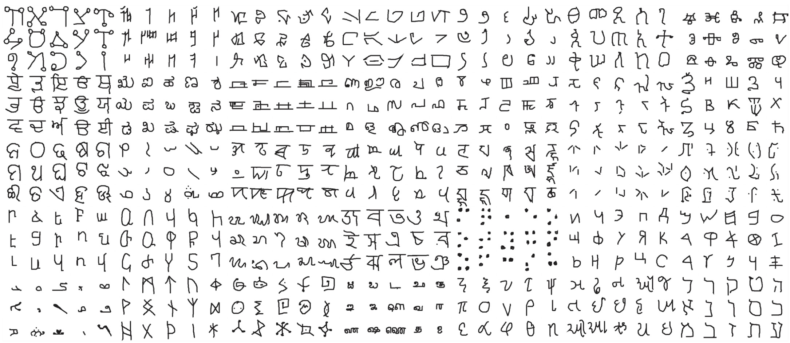
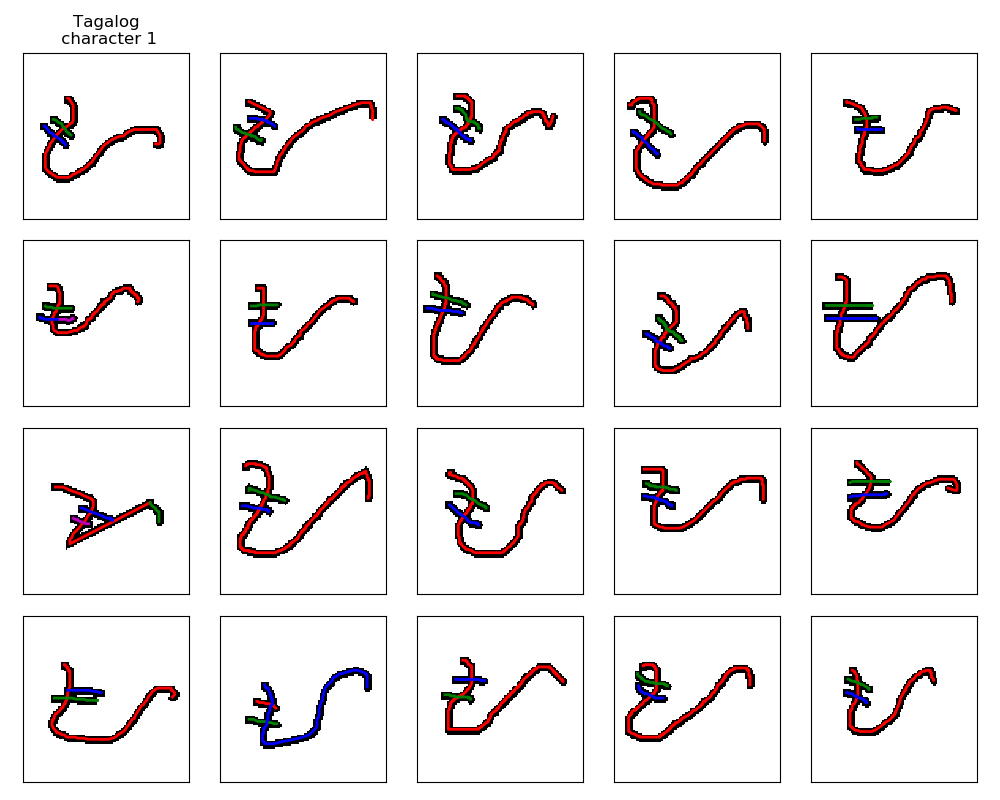

# Omniglot data set for one-shot learning

The Omniglot data set is designed for developing more human-like learning algorithms. It contains 1623 different handwritten characters from 50 different alphabets. Each of the 1623 characters was drawn online via Amazon's Mechanical Turk by 20 different people. Each image is paired with stroke data, a sequences of [x,y,t] coordinates with time (t) in milliseconds.

### NEW RELEASE (Jan. 2019)

**The stroke data is now available with python starter code and raw text files.** Run python/demo.py for an example of how to use it. All other files remain unchanged.

### Citing this data set
Please cite the following paper:

[Lake, B. M., Salakhutdinov, R., and Tenenbaum, J. B. (2015). Human-level concept learning through probabilistic program induction.](http://www.sciencemag.org/content/350/6266/1332.short) _Science_, 350(6266), 1332-1338.

And see our progress report on the challenge:

[Lake, B. M., Salakhutdinov, R., and Tenenbaum, J. B. (2019). The Omniglot Challenge: A 3-Year Progress Report.](https://arxiv.org/abs/1902.03477) Preprint available on arXiv:1902.03477. 

We are grateful for the [Omniglot](http://www.omniglot.com/) encyclopedia of writing systems for helping to make this data set possible, and for [Jason Gross](https://people.csail.mit.edu/jgross/) who was essential to the development and collection of this data set.

### CONTENTS
The Omniglot data set contains 50 alphabets. We split these into a background set of 30 alphabets and an evaluation set of 20 alphabets. To compare with the results in our paper, only the background set should be used to learn general knowledge about characters (e.g., feature learning, meta-learning, or hyperparameter inference). One-shot learning results are reported using alphabets from the evaluation set.

Two more challenging  "minimal" splits contain only five background alphabets, denoted as "background small 1" and "background small 2". This is a closer approximation to the experience that a human adult might have for characters in general.  For the goal of building human-level AI systems with minimal training, given a rough estimate of what "minimal" means for people, there is a need to explore settings with fewer training examples per class and fewer background classes for learning to learn.

### PYTHON

Python 2.*   
Requires scipy, matplotlib, and numpy   

Learn about the structure of the data set by unzipping the directories and running python/demo.py. This produces figures like this one, with different colors indicating different strokes:

   

Key data files (images and strokes):  
images_background.zip   
strokes_background.zip   
images_evaluation.zip   
strokes_evaluation.zip  

Key data files for the two "minimal" splits:      
images_background_small1.zip   
strokes_background_small1.zip   
images_background_small2.zip   
strokes_background_small2.zip    
The evaluation set is the same as above.        

A character is a series of pen coordinates (x,y,time) beginning with "START". Breaks between pen strokes are denoted as "BREAK" (indicating a pen up action). The stroke data is raw. It has non-uniform spatial and temporal sampling intervals, as the data was collected from many different web browsers and computers. For most applications, you will want to interpolate to get uniform spatial or temporal sampling intervals.

Our one-shot classification task requires within-alphabet discrimination, which is more challenging than the between-alphabet discrimination tasks used elsewhere. To compare with the one-shot classification results in our paper, enter the 'one-shot-classification' directory and unzip 'all_runs.zip' and place all the folders 'run01',...,'run20' in the current directory. Run 'demo_classification.py' to demo a baseline model using Modified Hausdorff Distance. 

### MATLAB

Learn about the structure of the data set by running the script 'demo.m'.   

Key data files (images and strokes):   
data_background.mat   
data_evaluation.mat   
data_background_small1.mat   
data_background_small2.mat   

To compare with the one-shot classification results in our paper, run 'demo_classification.m' in the 'one-shot-classification' folder to demo a baseline model using Modified Hausdorff Distance.
